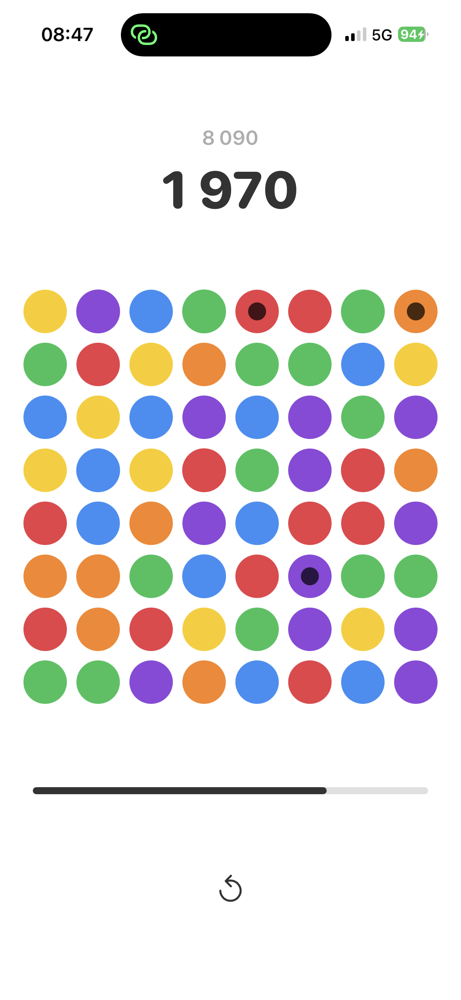
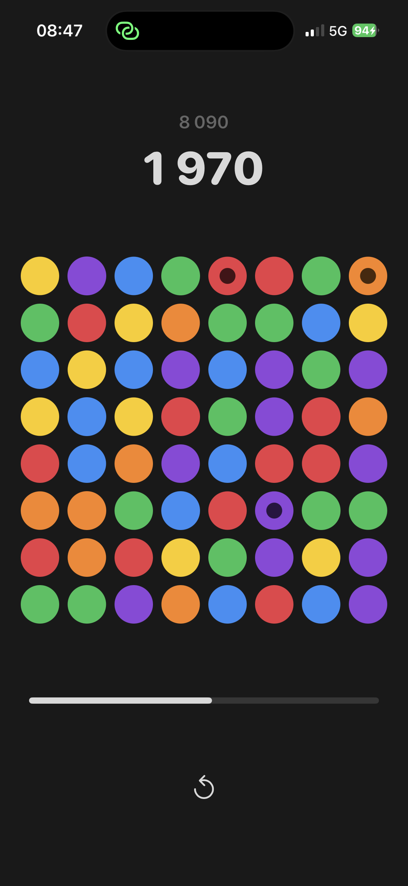

<p align="center">
  
  &nbsp;&nbsp;&nbsp;
  
</p>

# Gribli

A fast-paced timed match-3 puzzle game built entirely in Swift and SwiftUI.

Swap emojis, chain combos, trigger bombs, and race against the clock. Every match buys you more time.

## Features

- Timed gameplay with time bonuses on matches and combos
- Bomb tiles that clear surrounding area and grant extra seconds
- Cascade chain reactions
- Online leaderboard (best score per player)
- Pause/resume and restart
- Haptic feedback

## Tech

- Swift / SwiftUI — iOS 17.6+
- Cloudflare Workers + D1 for the leaderboard API
- Zero third-party dependencies on the client (URLSession + CryptoKit)

## Setup

The app requires a `Gribli/Secrets.swift` file (gitignored) for HMAC request signing:

```swift
enum Secrets {
    static let hmacKey = "your_hmac_secret_here"
}
```

## License

MIT License — see [LICENSE](LICENSE) for details.

---

[Support](support/SUPPORT.md) | [Privacy Policy](support/PRIVACY.md) | [Terms of Service](support/TERMS.md)

Personal project by [@cassardp](https://github.com/cassardp).
